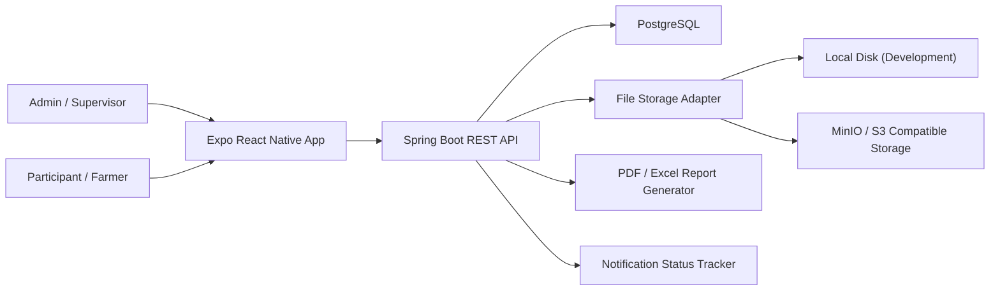
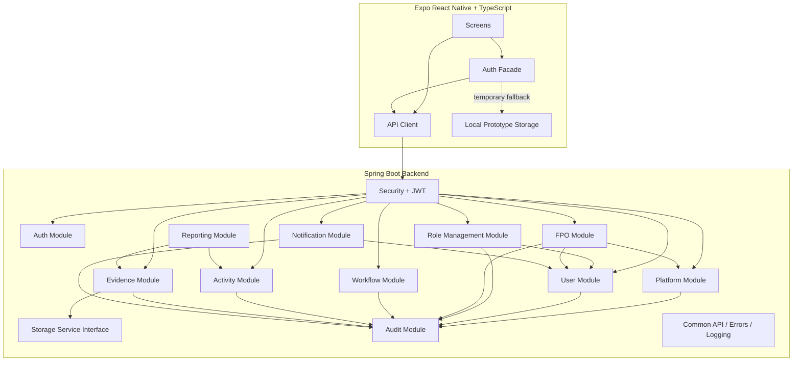
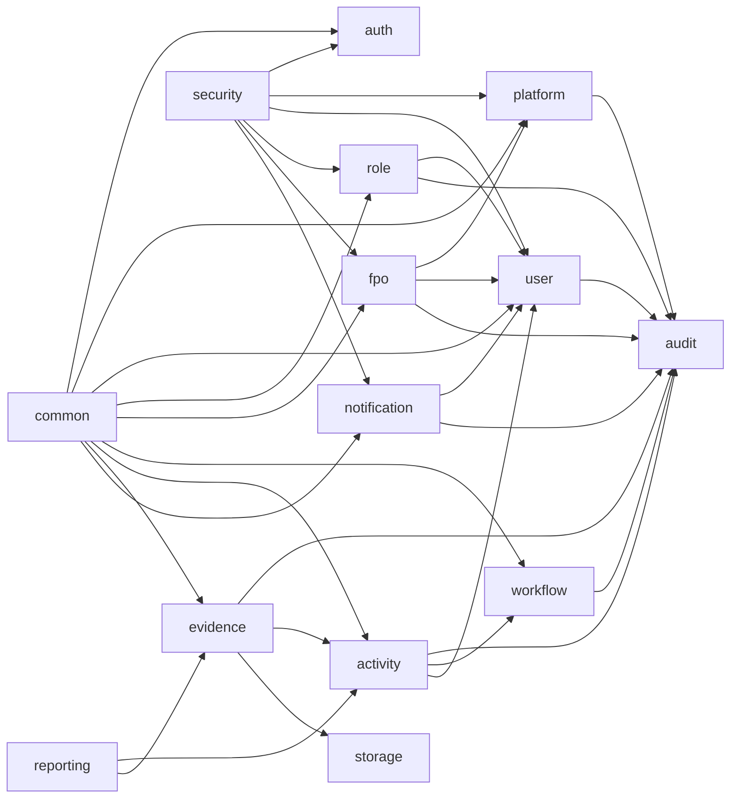
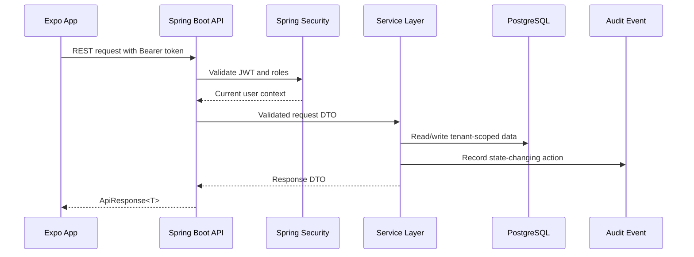
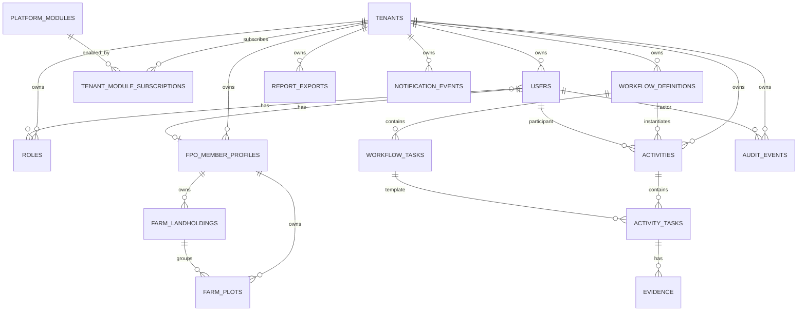
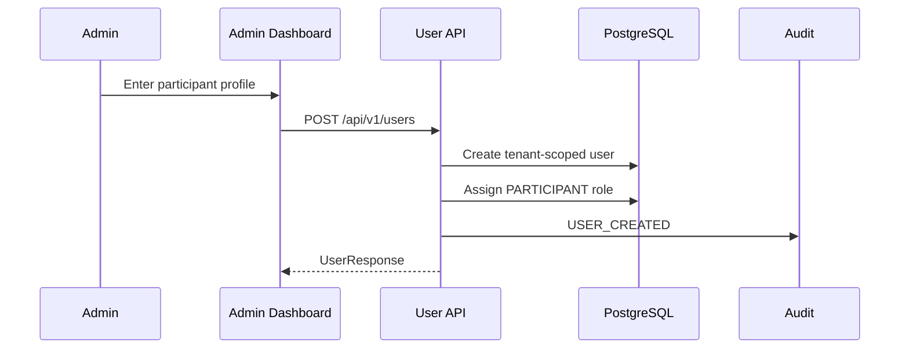
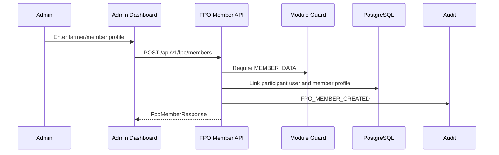
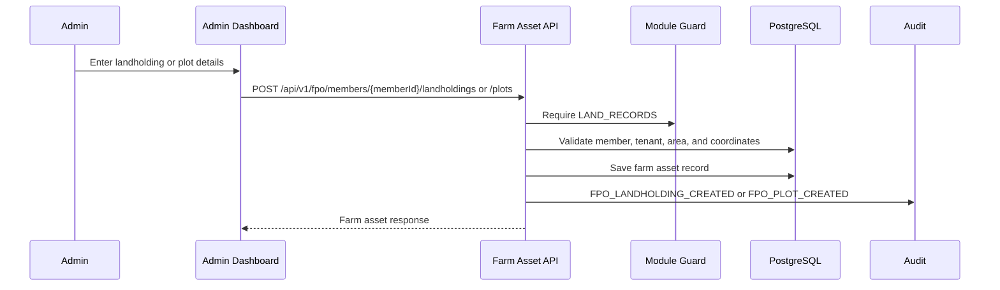
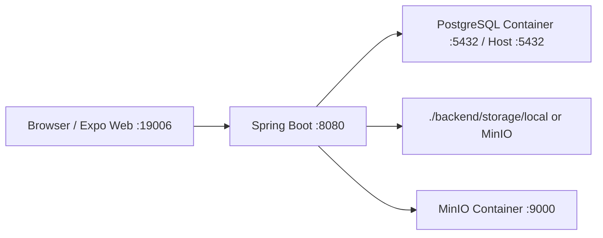

# Architecture Guide

## Purpose

This project is a reusable activity-compliance platform. Agriculture is the
first client domain, but the core architecture should also support warehouse
inspection, field worker tracking, dairy operations, factory audit workflows,
NGO field activity tracking, and construction progress tracking.

The main design rule is:

```text
Generic core + client-specific configuration
```

Shared backend and frontend code should use platform language:

- `Tenant`: one client organization.
- `User`: admin, supervisor, participant, farmer, field worker, or inspector.
- `Module`: sellable product capability enabled per tenant.
- `Workflow`: configurable process definition.
- `Task`: one ordered workflow step.
- `Activity`: one execution of a workflow.
- `Evidence`: photo, file, note, or proof metadata for a task.
- `AuditEvent`: immutable record of important system actions.
- `Report`: generated dashboard, PDF, or Excel output.

Agriculture words such as farmer, crop, plot, harvest, village, and government
report belong in UI copy, seed data, workflow configuration, and exported report
labels. They should not be hardcoded into the reusable core.

## System Context

For the deeper component-by-component view and database class diagrams, see
[Component And Data Model Diagrams](component-and-data-model-diagrams.md).
For module packaging, tenant subscription checks, and the decision to avoid
microservices until operationally necessary, see
[Modular Platform Strategy](modular-platform-strategy.md).



## Runtime Architecture



## Backend Module Boundaries



Module responsibilities:

- `common`: API envelope, page response, exception handling, request tracing.
- `security`: Spring Security, JWT resource server, role conversion.
- `auth`: login, refresh, current user, seed users, tenant/user/role entities.
- `platform`: module catalog, tenant subscriptions, and module guards.
- `user`: admin profile management for participant/farmer users.
- `role`: tenant role catalog and admin-controlled user role assignment.
- `fpo`: FPO member profiles, landholdings, plots, and Phase 1
  farmer/land/crop/input data model.
- `workflow`: reusable workflow definitions and task templates.
- `activity`: workflow execution, participant timeline, task status.
- `evidence`: proof upload metadata and evidence review status.
- `storage`: shared file validation/key planning with local disk for dev/test and MinIO/S3-compatible storage for production.
- `audit`: append-only compliance trail.
- `reporting`: tenant-scoped summary metrics plus PDF and XLSX exports built from activity/evidence data.
- `notification`: notification status and future delivery framework.

## Request Flow



## Core Data Model



## Roles

Current platform roles:

- `ADMIN`: full tenant administration, user/profile creation, workflow setup.
- `SUPERVISOR`: operational management and review.
- `PARTICIPANT`: field/farmer user who executes activities and uploads proof.

Role checks are enforced at controller and service boundaries. JWT roles are
mapped to Spring authorities as `ROLE_ADMIN`, `ROLE_SUPERVISOR`, and
`ROLE_PARTICIPANT`.

## Key Workflows

### Admin Creates Participant



### Admin Creates FPO Member



### Admin Maintains FPO Land Records



### Participant Loads Own Profile

```mermaid
sequenceDiagram
    participant Participant
    participant UI as Participant App
    participant API as User API
    participant DB as PostgreSQL

    Participant->>UI: Open profile tab
    UI->>API: GET /api/v1/users/me
    API->>DB: Load current tenant-scoped user
    API-->>UI: UserResponse with profile fields
```

### Participant Tracks Activity

```mermaid
sequenceDiagram
    participant Participant
    participant UI as Participant App
    participant API as Activity API
    participant DB as PostgreSQL
    participant AUD as Audit

    Participant->>UI: Start workflow activity
    UI->>API: POST /api/v1/activities
    API->>DB: Create activity and task timeline
    API->>AUD: ACTIVITY_CREATED
    Participant->>UI: Mark task / submit proof
    UI->>API: POST /api/v1/evidence
    API->>DB: Store evidence metadata
    API->>AUD: EVIDENCE_SUBMITTED
```

## Frontend Architecture

Frontend folders:

- `src/auth`: login facade, backend auth, session storage.
- `src/core/api`: API client, endpoint registry, response contracts.
- `src/core/config`: environment-style app constants.
- `src/core/errors`: frontend error model.
- `src/core/model`: reusable frontend types.
- `src/core/storage`: AsyncStorage JSON helpers.
- `src/core/workflow`: frontend workflow helpers.
- `src/data`: local prototype stores and agriculture configuration.
- `src/data/moduleStore.ts`: enabled-module cache for tenant navigation.
- `src/screens`: app screens.
- `src/ui`: shared UI components.

The frontend is backend-first for login, admin participant management,
workflow/activity timelines, proof upload, evidence review, reports, role
management, notifications, and participant profile display. Local storage
fallback remains only for development/offline prototype use.

After backend login, the frontend loads `/api/v1/platform/modules/enabled` and
hides disabled admin tabs. This is a UX guard only; backend module checks remain
the enforcement boundary.

## Backend Architecture

Backend package root:

```text
com.activityplatform.backend
```

Controller responsibilities:

- Map HTTP endpoints.
- Validate request DTOs.
- Return `ApiResponse<T>`.
- Avoid business rules.

Service responsibilities:

- Own transaction boundaries.
- Enforce business rules.
- Enforce tenant access.
- Emit audit events for state changes.

Repository responsibilities:

- Persist entities.
- Express tenant-scoped queries.
- Avoid business decisions.

Entity responsibilities:

- Represent durable state.
- Provide narrow mutation methods for meaningful state changes.

## Storage Architecture

Current storage abstraction:

```text
FileStorageService
```

Current implementations:

```text
LocalFileStorageService
MinioFileStorageService
```

The evidence and reporting modules depend on the interface, not on the local
filesystem or MinIO SDK. Provider selection is handled by `app.storage.provider`.

## API Contract Standards

All backend responses use the envelope:

```json
{
  "success": true,
  "data": {},
  "error": null,
  "meta": null
}
```

Paged responses use:

```json
{
  "content": [],
  "page": {
    "page": 0,
    "size": 20,
    "totalElements": 0,
    "totalPages": 0
  }
}
```

Expected errors use `ApplicationException` and return stable error codes. The
backend never returns stack traces in API responses.

## Local Development Topology



Default local ports:

- Expo web: `19006`
- Spring Boot: `8080`
- PostgreSQL host port: `5432`
- MinIO API: `9000`
- MinIO console: `9001`

These ports can change as long as the frontend API base URL and backend CORS
settings are updated together.

## Design Rules For Reuse

- Keep workflows data-driven in database tables.
- Do not hardcode crop lifecycle stages in Java or TypeScript.
- Keep participant/farmer as a role/use case, not as the core user model.
- Keep storage behind an interface.
- Keep reports generated from reusable activity/evidence data.
- Add tenant ids to durable business tables.
- Keep audit events append-only.
- Prefer clear module boundaries over premature framework abstraction.
