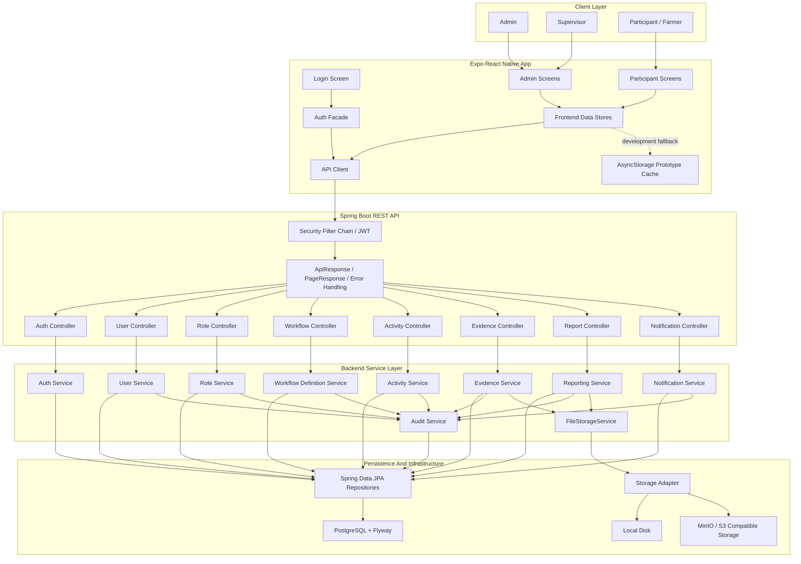
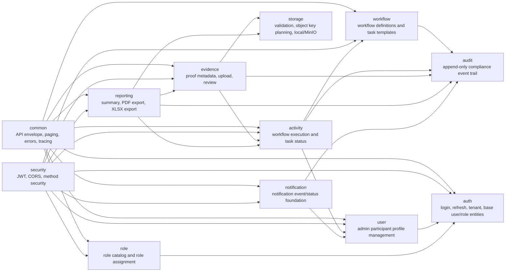
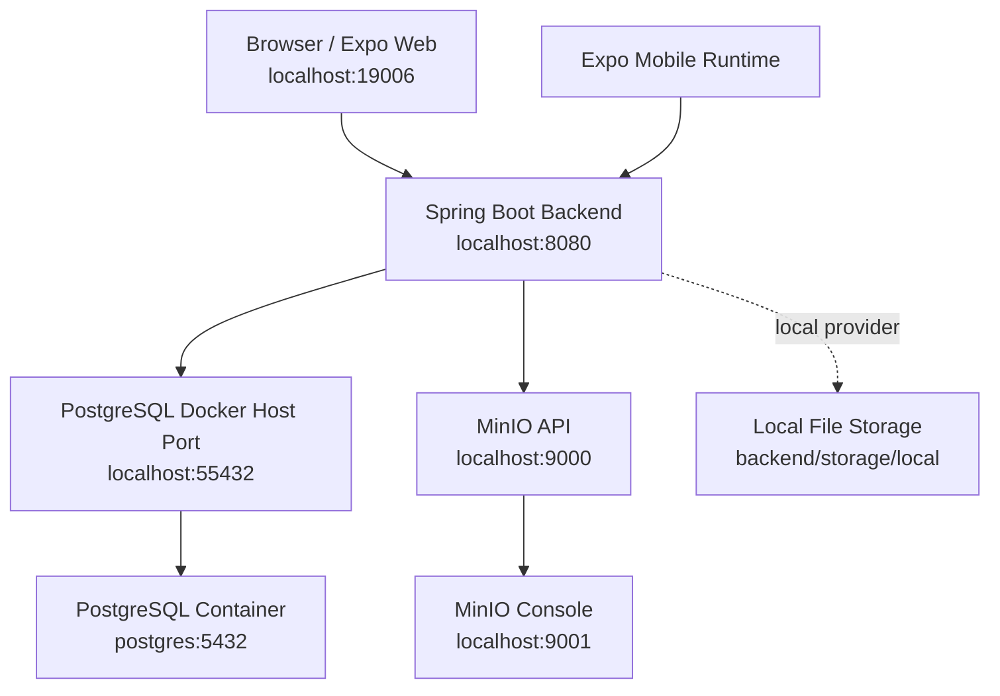
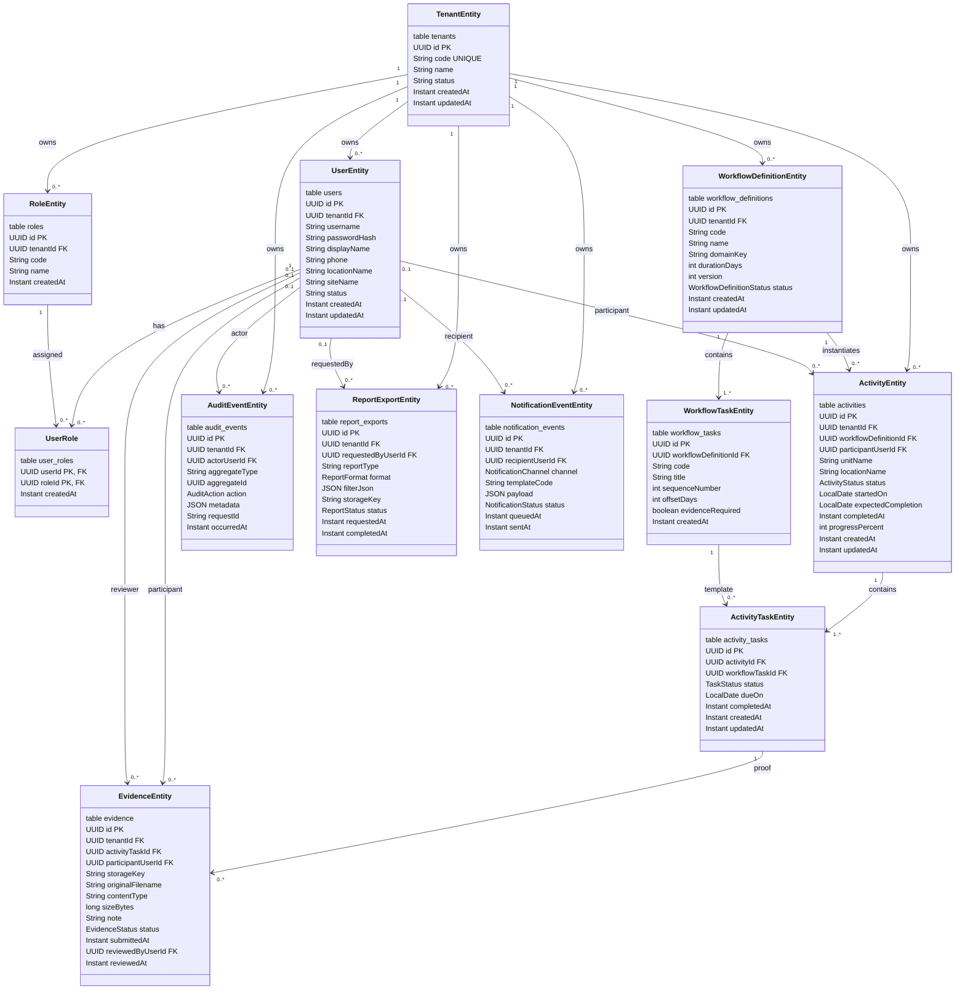
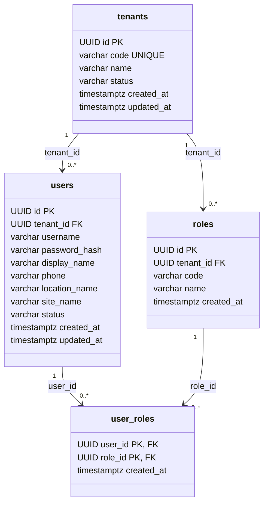
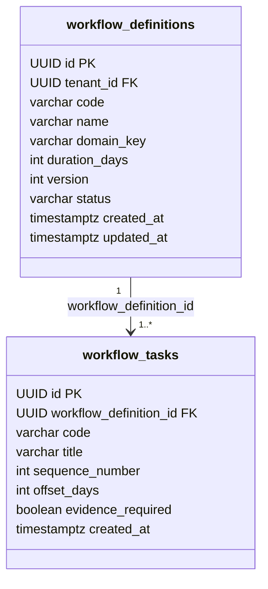
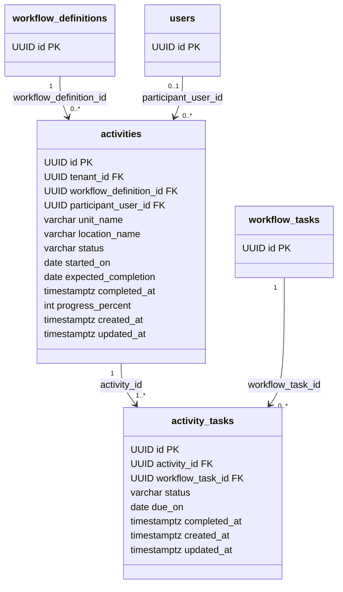
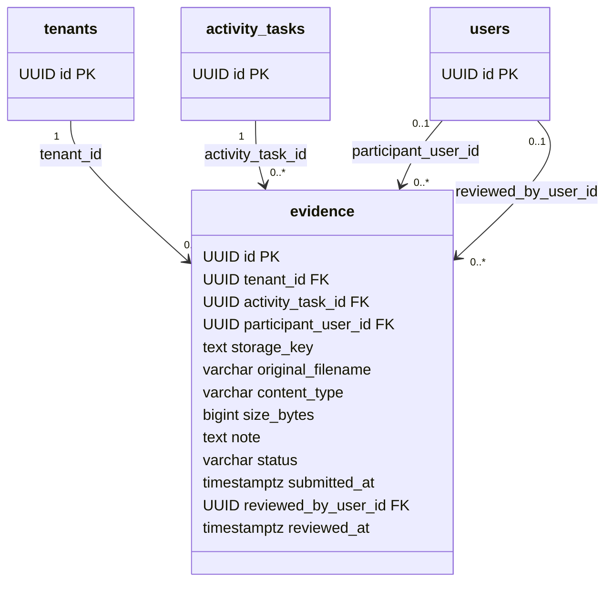
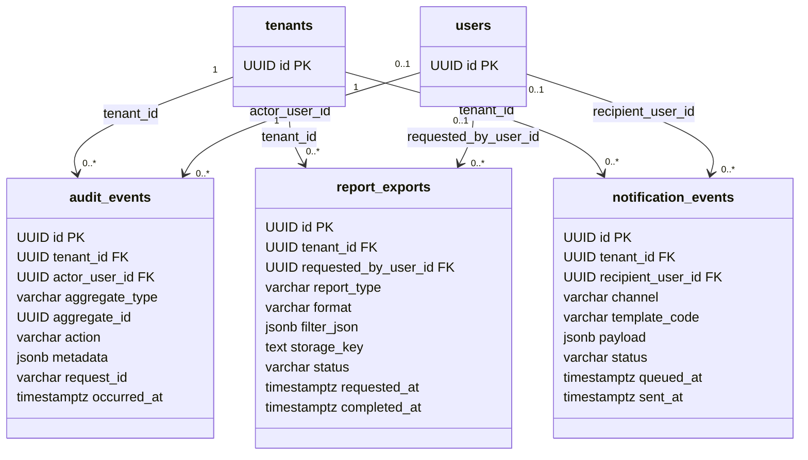
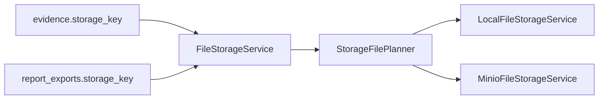

# Component And Data Model Diagrams

This document gives a visual map of the current platform. It is meant for
handoff, onboarding, debugging, and deciding where a future feature belongs.

## Component Architecture



## Backend Module Components



## Deployment Components



## Database Class Diagram: Full Model

This is the whole durable model at a glance. Class names match JPA entities and
comments show the backing PostgreSQL table.



## Identity And Access Tables



Important constraints:

- `users`: unique `(tenant_id, username)`.
- `roles`: unique `(tenant_id, code)`.
- `user_roles`: composite primary key `(user_id, role_id)`.
- Current role codes: `ADMIN`, `SUPERVISOR`, `PARTICIPANT`.

## Workflow Definition Tables



Important constraints:

- `workflow_definitions`: unique `(tenant_id, code, version)`.
- `workflow_tasks`: unique `(workflow_definition_id, code)`.
- `workflow_tasks`: unique `(workflow_definition_id, sequence_number)`.
- Definition status values: `DRAFT`, `ACTIVE`, `ARCHIVED`.

## Activity Execution Tables



Important constraints:

- `activity_tasks`: unique `(activity_id, workflow_task_id)`.
- Activity status values: `RUNNING`, `COMPLETED`, `CANCELLED`.
- Task status values: `PENDING`, `NEXT`, `DONE`, `SKIPPED`.
- `activities.progress_percent` is derived from activity task completion.

## Evidence Review Tables



Important rules:

- File bytes live in the configured storage provider; `evidence` stores metadata
  and the stable storage key.
- Evidence status values: `SUBMITTED`, `PENDING_REVIEW`, `APPROVED`,
  `REJECTED`.
- Reviewer fields are nullable until an admin/supervisor reviews the proof.

## Audit, Report, And Notification Tables



Important rules:

- `audit_events` is append-only application history.
- `report_exports.storage_key` points to generated PDF/XLSX output.
- Report formats: `PDF`, `XLSX`.
- Report statuses: `QUEUED`, `RUNNING`, `COMPLETED`, `FAILED`.
- Notification channels: `IN_APP`, `EMAIL`, `SMS`, `PUSH`.
- Notification statuses: `QUEUED`, `SENT`, `FAILED`, `SKIPPED`.

## Table To Module Ownership

| Table | Owner Module | Main API Surface |
| --- | --- | --- |
| `tenants` | `auth` | Seed/platform setup |
| `users` | `auth`, `user` | `/api/v1/auth/*`, `/api/v1/users/*` |
| `roles` | `auth`, `role` | `/api/v1/roles`, `/api/v1/users/{id}/roles` |
| `user_roles` | `role` | `/api/v1/users/{id}/roles` |
| `workflow_definitions` | `workflow` | `/api/v1/workflows` |
| `workflow_tasks` | `workflow` | `/api/v1/workflows` |
| `activities` | `activity` | `/api/v1/activities` |
| `activity_tasks` | `activity` | `/api/v1/activities/{id}/tasks/{taskId}/status` |
| `evidence` | `evidence` | `/api/v1/evidence` |
| `audit_events` | `audit` | Internal service writes |
| `report_exports` | `reporting` | `/api/v1/reports/export` |
| `notification_events` | `notification` | `/api/v1/notifications` |

## Storage Object Key Shape

Database rows never store local absolute paths. Evidence and report rows store a
provider-neutral object key.



Object keys are planned from the same reusable structure for local and MinIO
providers:

```text
tenant/{tenantId}/{ownerType}/{ownerId}/{uuid}-{safeFilename}
```

