# Component And Data Model Diagrams

This document gives a visual map of the current platform. It is meant for
handoff, onboarding, debugging, and deciding where a future feature belongs.

## Component Architecture

```mermaid
flowchart TB
    subgraph Clients["Client Layer"]
        AdminUser["Admin"]
        FPO_MANAGERUser["FPO_MANAGER"]
        FIELD_COORDINATORUser["FIELD_COORDINATOR / Farmer"]
    end

    subgraph ExpoApp["Expo React Native App"]
        Login["Login Screen"]
        AdminScreens["Admin Screens"]
        FIELD_COORDINATORScreens["FIELD_COORDINATOR Screens"]
        AuthFacade["Auth Facade"]
        ApiClient["API Client"]
        Stores["Frontend Data Stores"]
        LocalCache["AsyncStorage Prototype Cache"]
    end

    subgraph BackendApi["Spring Boot REST API"]
        Security["Security Filter Chain / JWT"]
        AuthController["Auth Controller"]
        PlatformController["Platform Controller"]
        UserController["User Controller"]
        RoleController["Role Controller"]
        FpoMemberController["FPO Member Controller"]
        FarmAssetController["Farm Asset Controller"]
        CropPlanningController["Crop Planning Controller"]
        InputDemandController["Input Demand Controller"]
        FpoReportController["FPO Report Controller"]
        WorkflowController["Workflow Controller"]
        ActivityController["Activity Controller"]
        EvidenceController["Evidence Controller"]
        ReportController["Report Controller"]
        NotificationController["Notification Controller"]
        ApiEnvelope["ApiResponse / PageResponse / Error Handling"]
    end

    subgraph Services["Backend Service Layer"]
        AuthService["Auth Service"]
        TenantModuleService["Tenant Module Service"]
        UserService["User Service"]
        RoleService["Role Service"]
        FpoMemberService["FPO Member Service"]
        FarmAssetService["Farm Asset Service"]
        CropPlanningService["Crop Planning Service"]
        InputDemandService["Input Demand Service"]
        FpoDashboardSummaryService["FPO Dashboard Summary Service"]
        WorkflowService["Workflow Definition Service"]
        ActivityService["Activity Service"]
        EvidenceService["Evidence Service"]
        ReportService["Reporting Service"]
        NotificationService["Notification Service"]
        AuditService["Audit Service"]
        StorageService["FileStorageService"]
    end

    subgraph Persistence["Persistence And Infrastructure"]
        Repositories["Spring Data JPA Repositories"]
        Postgres["PostgreSQL + Flyway"]
        StorageAdapter["Storage Adapter"]
        LocalDisk["Local Disk"]
        Minio["MinIO / S3 Compatible Storage"]
    end

    AdminUser --> AdminScreens
    FPO_MANAGERUser --> AdminScreens
    FIELD_COORDINATORUser --> FIELD_COORDINATORScreens
    Login --> AuthFacade
    AdminScreens --> Stores
    FIELD_COORDINATORScreens --> Stores
    Stores --> ApiClient
    Stores -. development fallback .-> LocalCache
    AuthFacade --> ApiClient
    ApiClient --> Security
    Security --> ApiEnvelope
    ApiEnvelope --> AuthController
    ApiEnvelope --> PlatformController
    ApiEnvelope --> UserController
    ApiEnvelope --> RoleController
    ApiEnvelope --> FpoMemberController
    ApiEnvelope --> FarmAssetController
    ApiEnvelope --> CropPlanningController
    ApiEnvelope --> InputDemandController
    ApiEnvelope --> FpoReportController
    ApiEnvelope --> WorkflowController
    ApiEnvelope --> ActivityController
    ApiEnvelope --> EvidenceController
    ApiEnvelope --> ReportController
    ApiEnvelope --> NotificationController

    AuthController --> AuthService
    PlatformController --> TenantModuleService
    UserController --> UserService
    RoleController --> RoleService
    FpoMemberController --> FpoMemberService
    FarmAssetController --> FarmAssetService
    CropPlanningController --> CropPlanningService
    InputDemandController --> InputDemandService
    FpoReportController --> FpoDashboardSummaryService
    WorkflowController --> WorkflowService
    ActivityController --> ActivityService
    EvidenceController --> EvidenceService
    ReportController --> ReportService
    NotificationController --> NotificationService

    AuthService --> Repositories
    TenantModuleService --> Repositories
    UserService --> Repositories
    RoleService --> Repositories
    FpoMemberService --> Repositories
    FarmAssetService --> Repositories
    CropPlanningService --> Repositories
    InputDemandService --> Repositories
    FpoDashboardSummaryService --> Repositories
    WorkflowService --> Repositories
    ActivityService --> Repositories
    EvidenceService --> Repositories
    ReportService --> Repositories
    NotificationService --> Repositories

    UserService --> AuditService
    RoleService --> AuditService
    TenantModuleService --> AuditService
    FpoMemberService --> AuditService
    FarmAssetService --> AuditService
    CropPlanningService --> AuditService
    InputDemandService --> AuditService
    FpoDashboardSummaryService --> AuditService
    WorkflowService --> AuditService
    ActivityService --> AuditService
    EvidenceService --> AuditService
    ReportService --> AuditService
    NotificationService --> AuditService
    AuditService --> Repositories

    EvidenceService --> StorageService
    ReportService --> StorageService
    StorageService --> StorageAdapter
    StorageAdapter --> LocalDisk
    StorageAdapter --> Minio
    Repositories --> Postgres
```

## Backend Module Components

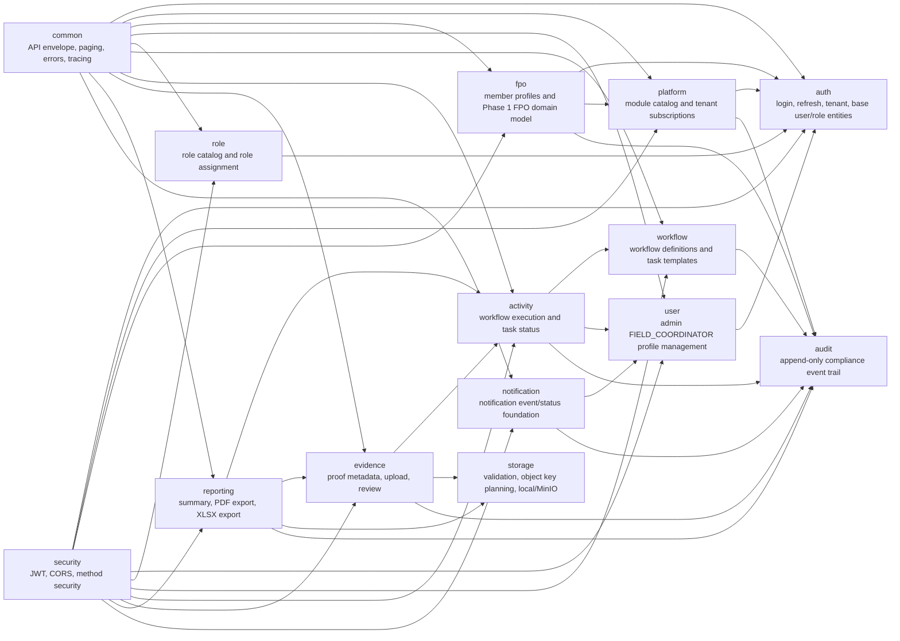

## Deployment Components


## Database Class Diagram: Full Model

This is the whole durable model at a glance. Class names match JPA entities and
comments show the backing PostgreSQL table.

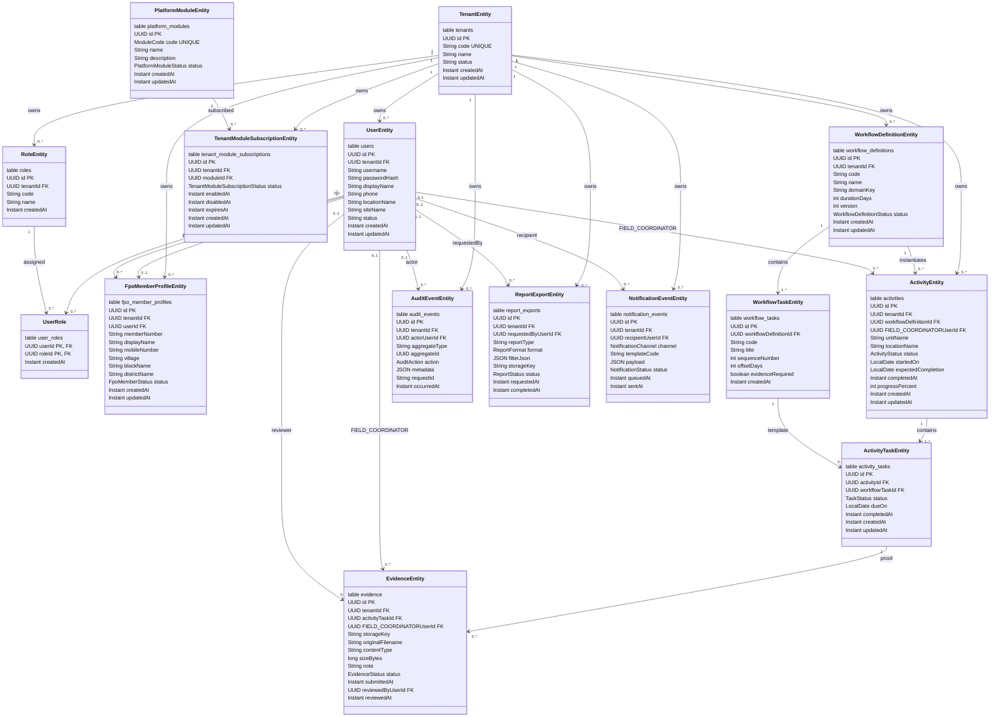

## Identity And Access Tables

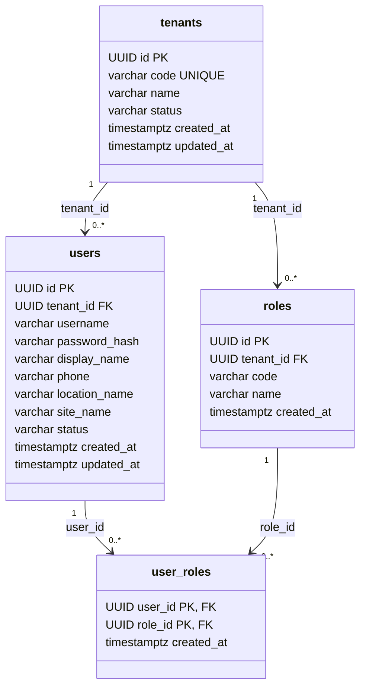

Important constraints:

- `users`: unique `(tenant_id, username)`.
- `roles`: unique `(tenant_id, code)`.
- `user_roles`: composite primary key `(user_id, role_id)`.
- Current role codes: `ADMIN`, `FPO_MANAGER`, `FIELD_COORDINATOR`.

## Module Subscription Tables

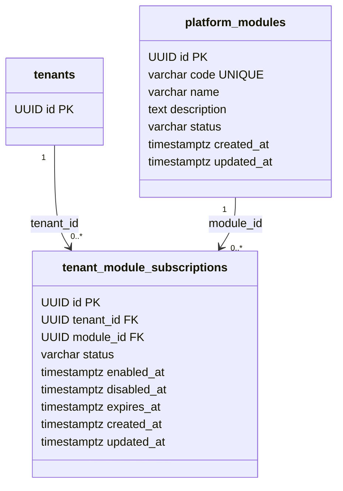

Important rules:

- `platform_modules.code` is the stable product module key.
- `tenant_module_subscriptions`: unique `(tenant_id, module_id)`.
- Disabled modules return `MODULE_NOT_ENABLED` from guarded backend APIs.

## FPO Member And Farm Asset Tables

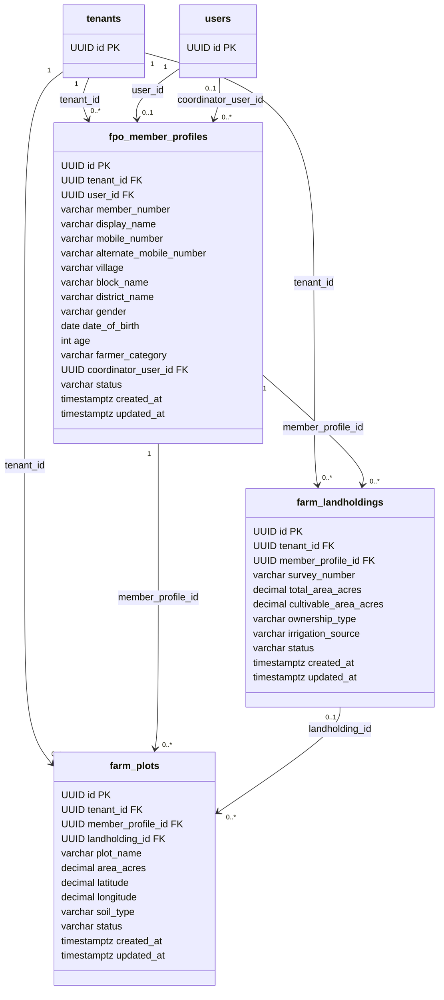

Important constraints:

- `fpo_member_profiles`: unique `(tenant_id, user_id)`.
- `fpo_member_profiles`: unique `(tenant_id, member_number)`.
- `fpo_member_profiles`: unique `(tenant_id, mobile_number)`.
- Member profile APIs are guarded by the `MEMBER_DATA` module.
- Landholding and plot APIs are guarded by the `LAND_RECORDS` module.
- Farm asset status values are `ACTIVE`, `INACTIVE`, and `ARCHIVED`.

## FPO Crop Planning Tables

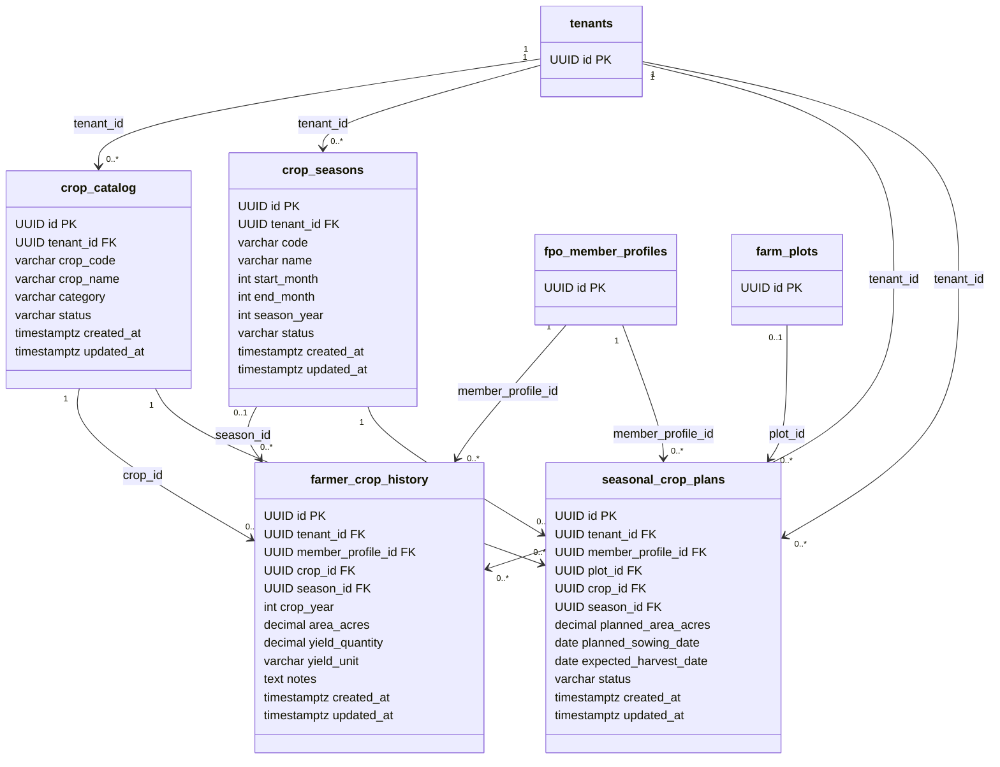

Important constraints:

- `crop_catalog`: unique `(tenant_id, crop_code)`.
- `crop_seasons`: unique `(tenant_id, code, season_year)`.
- Crop and season APIs are guarded by the `CROP_PLANNING` module.
- Crop and season status values are `ACTIVE`, `INACTIVE`, and `ARCHIVED`.
- Crop plan status values are `DRAFT`, `CONFIRMED`, `CANCELLED`, and
  `COMPLETED`.
- Seasonal plans may reference a plot; when they do, the plot must be active
  and owned by the selected FPO member.

## FPO Input Demand Tables

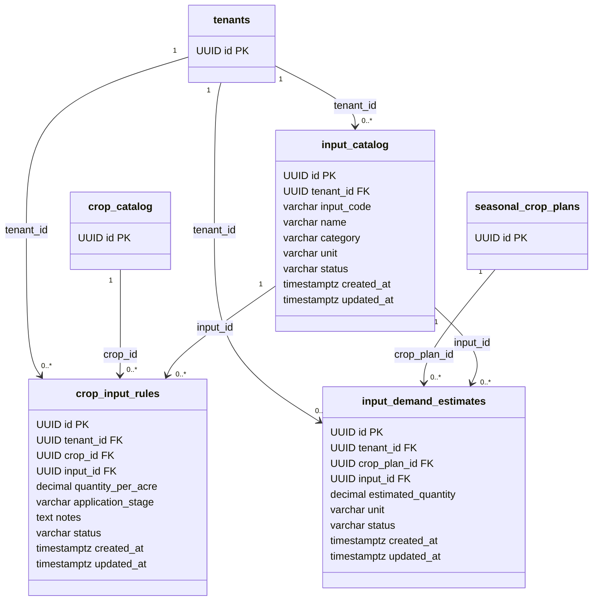

Important constraints:

- `input_catalog`: unique `(tenant_id, input_code)`.
- `crop_input_rules`: unique `(tenant_id, crop_id, input_id, application_stage)`.
- `input_demand_estimates`: unique `(crop_plan_id, input_id)`.
- Input demand APIs are guarded by the `INPUT_DEMAND` module.
- Input and rule status values are `ACTIVE`, `INACTIVE`, and `ARCHIVED`.
- Demand estimate status values currently use `ESTIMATED` and `SUPERSEDED`.
- Demand calculation defaults to `CONFIRMED` seasonal crop plans and sums
  multiple active stages for the same crop/input into one estimate row.

## Workflow Definition Tables

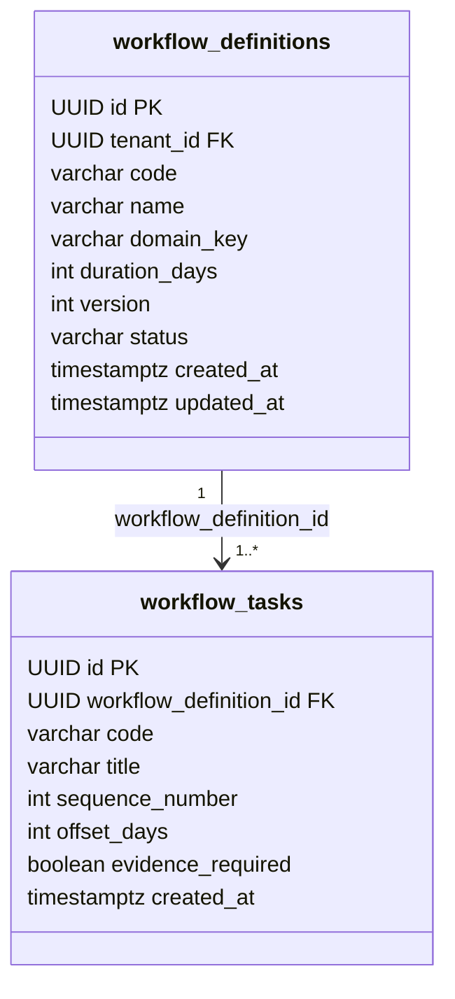

Important constraints:

- `workflow_definitions`: unique `(tenant_id, code, version)`.
- `workflow_tasks`: unique `(workflow_definition_id, code)`.
- `workflow_tasks`: unique `(workflow_definition_id, sequence_number)`.
- Definition status values: `DRAFT`, `ACTIVE`, `ARCHIVED`.

## Activity Execution Tables

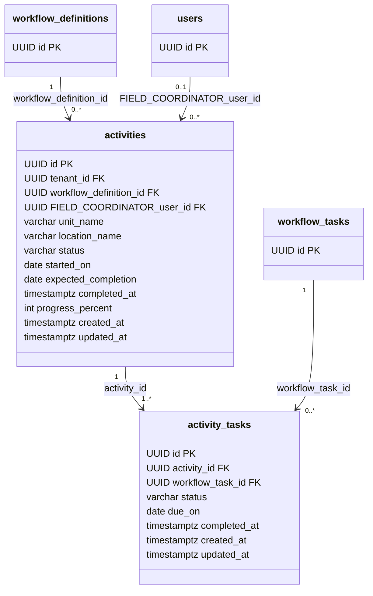

Important constraints:

- `activity_tasks`: unique `(activity_id, workflow_task_id)`.
- Activity status values: `RUNNING`, `COMPLETED`, `CANCELLED`.
- Task status values: `PENDING`, `NEXT`, `DONE`, `SKIPPED`.
- `activities.progress_percent` is derived from activity task completion.

## Evidence Review Tables

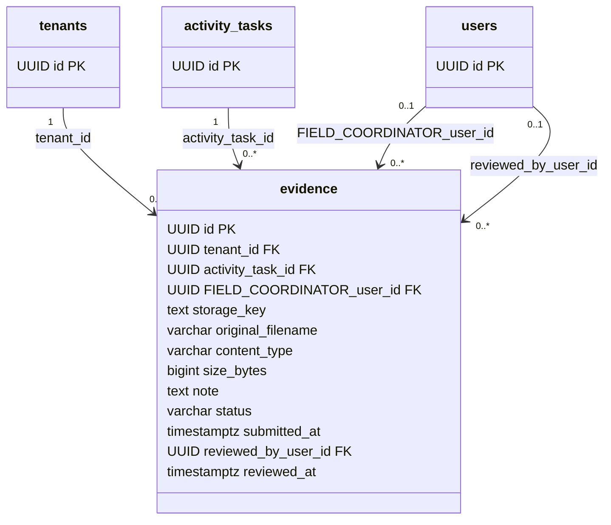

Important rules:

- File bytes live in the configured storage provider; `evidence` stores metadata
  and the stable storage key.
- Evidence status values: `SUBMITTED`, `PENDING_REVIEW`, `APPROVED`,
  `REJECTED`.
- Reviewer fields are nullable until an admin/FPO_MANAGER reviews the proof.

## Audit, Report, And Notification Tables

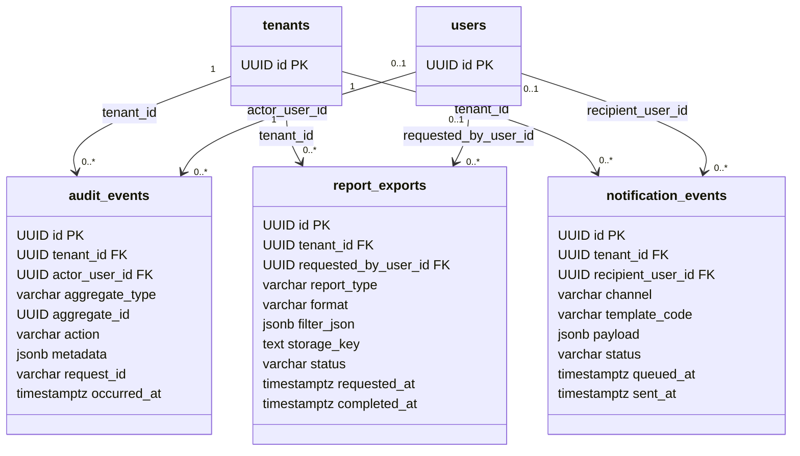

Important rules:

- `audit_events` is append-only application history.
- `report_exports.storage_key` points to generated PDF/XLSX output.
- Report formats: `PDF`, `XLSX`.
- Report statuses: `QUEUED`, `RUNNING`, `COMPLETED`, `FAILED`.
- Notification channels: `IN_APP`, `EMAIL`, `SMS`, `PUSH`.
- Notification statuses: `QUEUED`, `SENT`, `FAILED`, `SKIPPED`.

## Table To Module Ownership

| Table | Owner Module | Main API Surface |
| --- | --- | --- |
| `tenants` | `auth` | Seed/platform setup |
| `users` | `auth`, `user` | `/api/v1/auth/*`, `/api/v1/users/*` |
| `roles` | `auth`, `role` | `/api/v1/roles`, `/api/v1/users/{id}/roles` |
| `user_roles` | `role` | `/api/v1/users/{id}/roles` |
| `platform_modules` | `platform` | `/api/v1/platform/modules` |
| `tenant_module_subscriptions` | `platform` | `/api/v1/platform/module-subscriptions`, `/api/v1/platform/modules/enabled` |
| `fpo_member_profiles` | `fpo` | `/api/v1/fpo/members` |
| `farm_landholdings` | `fpo` | `/api/v1/fpo/members/{memberId}/landholdings`, `/api/v1/fpo/landholdings/{id}` |
| `farm_plots` | `fpo` | `/api/v1/fpo/members/{memberId}/plots`, `/api/v1/fpo/plots/{id}` |
| `crop_catalog` | `fpo` | `/api/v1/fpo/crops` |
| `crop_seasons` | `fpo` | `/api/v1/fpo/seasons` |
| `farmer_crop_history` | `fpo` | `/api/v1/fpo/members/{memberId}/crop-history`, `/api/v1/fpo/crop-history/{id}` |
| `seasonal_crop_plans` | `fpo` | `/api/v1/fpo/crop-plans` |
| `input_catalog` | `fpo` | `/api/v1/fpo/inputs` |
| `crop_input_rules` | `fpo` | `/api/v1/fpo/input-rules` |
| `input_demand_estimates` | `fpo` | `/api/v1/fpo/demand-estimates`, `/api/v1/fpo/demand-estimates/summary` |
| `workflow_definitions` | `workflow` | `/api/v1/workflows` |
| `workflow_tasks` | `workflow` | `/api/v1/workflows` |
| `activities` | `activity` | `/api/v1/activities` |
| `activity_tasks` | `activity` | `/api/v1/activities/{id}/tasks/{taskId}/status` |
| `evidence` | `evidence` | `/api/v1/evidence` |
| `audit_events` | `audit` | Internal service writes |
| `report_exports` | `reporting` | `/api/v1/reports/export` |
| `notification_events` | `notification` | `/api/v1/notifications` |

## Storage Object Key Shape

Database rows never store local absolute paths. Evidence and report rows store a
provider-neutral object key.

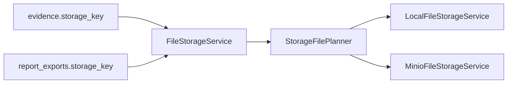

Object keys are planned from the same reusable structure for local and MinIO
providers:

```text
tenant/{tenantId}/{ownerType}/{ownerId}/{uuid}-{safeFilename}
```
