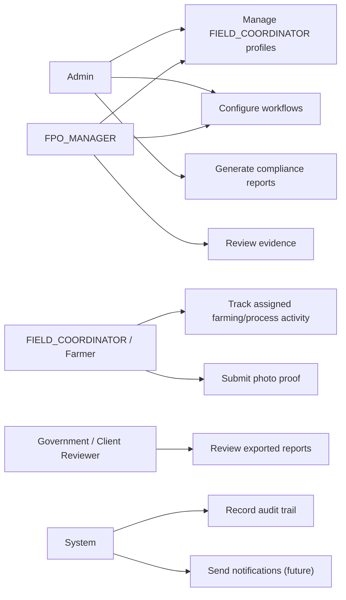
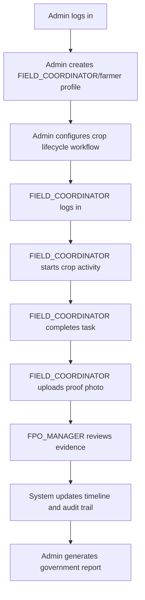

# Use Case Guide

## Actors

## Use Case Diagram

```mermaid
flowchart TB
    Admin["Admin"]
    FPO_MANAGER["FPO_MANAGER"]
    FIELD_COORDINATOR["FIELD_COORDINATOR / Farmer"]
    Reviewer["Government / Client Reviewer"]

    UC1["Login"]
    UC2["Create FIELD_COORDINATOR profile"]
    UC3["Activate / deactivate FIELD_COORDINATOR"]
    UC4["View own profile"]
    UC5["Create workflow definition"]
    UC6["Update workflow status"]
    UC7["Start activity"]
    UC8["View activity timeline"]
    UC9["Update task status"]
    UC10["Upload evidence photo"]
    UC11["Review evidence"]
    UC12["View audit trail"]
    UC13["Generate PDF / Excel report"]
    UC14["View analytics summary"]

    Admin --> UC1
    FPO_MANAGER --> UC1
    FIELD_COORDINATOR --> UC1
    Admin --> UC2
    FPO_MANAGER --> UC2
    Admin --> UC3
    FPO_MANAGER --> UC3
    FIELD_COORDINATOR --> UC4
    Admin --> UC5
    FPO_MANAGER --> UC5
    Admin --> UC6
    FPO_MANAGER --> UC6
    Admin --> UC7
    FPO_MANAGER --> UC7
    FIELD_COORDINATOR --> UC7
    Admin --> UC8
    FPO_MANAGER --> UC8
    FIELD_COORDINATOR --> UC8
    FIELD_COORDINATOR --> UC9
    FIELD_COORDINATOR --> UC10
    FPO_MANAGER --> UC11
    Admin --> UC11
    Admin --> UC12
    FPO_MANAGER --> UC12
    Admin --> UC13
    FPO_MANAGER --> UC13
    Reviewer --> UC13
    Admin --> UC14
    FPO_MANAGER --> UC14
```

## Primary Use Cases

### UC-01 Login

Actors:

- Admin
- FPO_MANAGER
- FIELD_COORDINATOR

Goal:

- Authenticate into the platform with tenant, username, and password.

Preconditions:

- User exists.
- User status is `ACTIVE`.

Main flow:

1. User enters username and password.
2. Frontend sends `POST /api/v1/auth/login`.
3. Backend validates tenant, user status, password hash, and roles.
4. Backend returns access token, refresh token, user id, tenant id, and roles.
5. Frontend stores session data and routes user by role.

Failure cases:

- Invalid credentials return `401`.
- Invalid request body returns `400`.
- Inactive user cannot log in.

### UC-02 Create FIELD_COORDINATOR Profile

Actors:

- Admin
- FPO_MANAGER

Goal:

- Create a tenant-scoped FIELD_COORDINATOR/farmer profile with login credentials.

Preconditions:

- Actor has `ADMIN` or `FPO_MANAGER` role.

Main flow:

1. Admin opens FIELD_COORDINATOR management.
2. Admin enters full name, phone, region, village/site, username, and password.
3. Frontend calls `POST /api/v1/users`.
4. Backend validates request.
5. Backend creates user with `FIELD_COORDINATOR` role.
6. Backend records `USER_CREATED` audit event.
7. Frontend refreshes FIELD_COORDINATOR list.

Failure cases:

- Duplicate username returns `409`.
- Missing/invalid fields return `400`.
- FIELD_COORDINATOR user attempting this action returns `403`.

### UC-03 Activate Or Deactivate FIELD_COORDINATOR

Actors:

- Admin
- FPO_MANAGER

Goal:

- Control whether a FIELD_COORDINATOR can continue using the platform without deleting
  history.

Main flow:

1. Admin selects active/inactive action for a FIELD_COORDINATOR.
2. Frontend calls `PATCH /api/v1/users/{userId}/status`.
3. Backend updates status.
4. Backend records `USER_STATUS_CHANGED`.
5. Frontend updates the FIELD_COORDINATOR card.

### UC-04 View Own Profile

Actors:

- FIELD_COORDINATOR

Goal:

- View backend-owned FIELD_COORDINATOR profile fields assigned by an admin or
  FPO_MANAGER.

Main flow:

1. FIELD_COORDINATOR logs in.
2. FIELD_COORDINATOR opens profile tab.
3. Frontend calls `GET /api/v1/users/me`.
4. Backend returns display name, phone, region/location, site/village, status,
   roles, tenant id, and user id.
5. Frontend displays the profile fields.

Business rules:

- Public/self-service signup is disabled.
- FIELD_COORDINATOR profile changes are handled by admin/FPO_MANAGER management APIs.

### UC-05 Configure Workflow

Actors:

- Admin
- FPO_MANAGER

Goal:

- Define a reusable process such as a crop lifecycle or inspection checklist.

Main flow:

1. Admin creates workflow definition.
2. Admin adds ordered tasks/stages.
3. Backend stores workflow and task templates.
4. Backend records workflow audit event.
5. Workflow can be activated for use.

Business rules:

- Workflow code/version are unique per tenant.
- Task codes and sequence numbers are unique inside a workflow.
- Workflows with activities should not be edited destructively; create a new
  version instead.

### UC-06 Start Activity

Actors:

- FIELD_COORDINATOR
- Admin
- FPO_MANAGER

Goal:

- Start one execution of a workflow for a FIELD_COORDINATOR, farm, plot, inspection
  site, or unit.

Main flow:

1. User selects workflow.
2. User enters unit/location details.
3. Frontend calls `POST /api/v1/activities`.
4. Backend creates activity and activity tasks from workflow template.
5. Backend records `ACTIVITY_CREATED`.

### UC-07 Submit Evidence

Actors:

- FIELD_COORDINATOR

Goal:

- Submit photo/file proof for a task.

Main flow:

1. FIELD_COORDINATOR opens task.
2. FIELD_COORDINATOR selects/captures photo and optional note.
3. Frontend calls `POST /api/v1/evidence` as multipart request.
4. Backend stores file through storage adapter.
5. Backend persists evidence metadata.
6. Backend marks task progress where applicable.
7. Backend records `EVIDENCE_SUBMITTED`.

### UC-08 Review Evidence

Actors:

- Admin
- FPO_MANAGER

Goal:

- Approve or reject submitted proof.

Main flow:

1. Reviewer opens evidence list.
2. Reviewer checks proof and context.
3. Reviewer sends approved/rejected status.
4. Backend records reviewer and timestamp.
5. Backend records `EVIDENCE_REVIEWED`.

### UC-09 Generate Compliance Report

Actors:

- Admin
- FPO_MANAGER
- Government/client reviewer

Goal:

- Produce report-ready evidence that the defined process was followed.

Planned report contents:

- FIELD_COORDINATOR coverage.
- Workflow/activity status.
- Ordered task completion.
- Evidence photos/files and timestamps.
- Review status.
- Audit trail summary.
- Region/crop/date filters.

Current status:

- Reporting summary, PDF export, and Excel export endpoints are implemented for
  the generic activity/evidence model.
- FPO-specific farmer, landholding, crop-plan, acreage, and input-demand report
  formats are still pending. See [FPO MVP Roadmap](fpo-mvp-roadmap.md).

## Role Permission Matrix

| Use Case                               | Admin | FPO_MANAGER | FIELD_COORDINATOR |
| -------------------------------------- | ----- | ---------- | ----------- |
| Login                                  | Yes   | Yes        | Yes         |
| Create FIELD_COORDINATOR                     | Yes   | Yes        | No          |
| Activate/deactivate FIELD_COORDINATOR        | Yes   | Yes        | No          |
| View own profile                       | Yes   | Yes        | Yes         |
| Create/update workflow                 | Yes   | Yes        | No          |
| Start own activity                     | Yes   | Yes        | Yes         |
| Start activity for another FIELD_COORDINATOR | Yes   | Yes        | No          |
| View own activities                    | Yes   | Yes        | Yes         |
| View tenant activities                 | Yes   | Yes        | No          |
| Upload evidence                        | Yes   | Yes        | Yes         |
| Review evidence                        | Yes   | Yes        | No          |
| Generate reports                       | Yes   | Yes        | No          |

## End-To-End Agriculture Scenario

